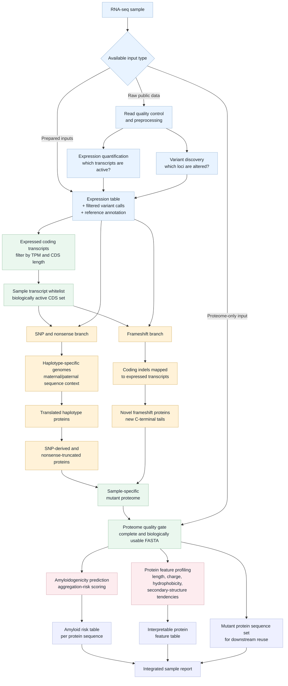

# Pipeline Block Scheme

This diagram describes the pipeline as a set of biological analysis blocks, in the spirit of a no-code workflow such as `blockr`: inputs enter as data objects, biologically meaningful transformations happen in blocks, and only interpretable outputs continue to downstream interpretation.

## Biological Flow



## What Each Block Means

| Block | Biological purpose | Main input | Main output |
|---|---|---|---|
| Read quality control | Confirms that RNA-seq reads are suitable for expression and variant analysis. | FASTQ reads | Cleaned reads and QC evidence |
| Expression quantification | Identifies transcripts that are active in the sample. | RNA-seq reads or transcript abundance | Expression table |
| Variant discovery | Finds sequence changes that may alter proteins. | RNA-seq alignment and reference genome | Filtered variant calls |
| Expressed coding transcripts | Keeps biologically relevant CDS records and removes weak or unsafe candidates. | Expression table and GTF | Active CDS set |
| SNP and nonsense branch | Builds proteins affected by SNPs and early stop codons. | SNP variants and active CDS set | SNP-derived and nonsense-truncated proteins |
| Frameshift branch | Captures coding indels that can create novel protein tails. | Indel variants and active CDS set | Frameshift-derived proteins |
| Mutant proteome assembly | Combines all valid altered proteins into one sample-level proteome. | SNP/nonsense proteins and frameshift proteins | Mutant protein sequence set |
| Proteome quality gate | Ensures the proteome is complete enough for interpretation. | Mutant proteome outputs | Verified proteome |
| Amyloidogenicity prediction | Scores proteins for aggregation or amyloid-like risk. | Verified mutant proteome | Amyloid risk table |
| Protein feature profiling | Adds interpretable biochemical descriptors. | Verified mutant proteome | Protein feature table |
| Integrated sample report | Combines sequence, risk, and feature outputs for downstream review. | Proteome, predictions, features | Final sample-level outputs |

## Biological Conditions

| Condition | Meaning |
|---|---|
| Expression threshold | Only expressed transcripts are used to build the sample-specific proteome. |
| Coding sequence length threshold | Very short CDS records are excluded because they are unlikely to produce interpretable protein sequences. |
| Mitochondrial transcript exclusion | Mitochondrial coding rules differ from the standard nuclear genetic code, so these records are removed from this proteome model. |
| SNP/nonsense separation from frameshifts | SNPs and indels affect proteins differently, so they are modeled in separate branches before being recombined. |
| Frameshift protein length threshold | Very short frameshift products are not treated as meaningful downstream protein candidates. |
| Proteome quality gate | Amyloid prediction and feature profiling run only after the mutant proteome is complete and internally consistent. |

## Suggested `blockr` Representation

| blockr element | Suggested contents |
|---|---|
| Input blocks | RNA-seq reads, expression table, variant calls, reference annotation, optional prebuilt mutant proteome |
| Transformation blocks | read QC, expression quantification, variant discovery, expressed CDS filtering, haplotype translation, frameshift translation, proteome assembly |
| Analysis blocks | amyloidogenicity prediction, protein feature profiling |
| Decision blocks | input type, expression threshold, CDS length threshold, frameshift length threshold, proteome quality gate |
| Output blocks | mutant protein sequence set, amyloid risk table, protein feature table, integrated sample report |

## Visual Assessment

The simplified diagram renders more clearly than the first technical version because it removes low-level failure nodes, file existence checks, implementation names, and repeated output filenames. The remaining blocks are larger biological concepts, so the visual flow now reads as:

```text
RNA-seq -> expression + variants -> active coding transcripts
       -> SNP/nonsense proteins + frameshift proteins
       -> mutant protein sequence set
       -> amyloid risk + protein features
       -> integrated report
```

Visual check result: block sizes are balanced on a desktop-width preview, text wraps cleanly, and the main biological story is easy to scan. The only remaining limitation is that Mermaid may draw some cross-branch arrows tightly depending on renderer width; for slides or a blockr mockup, a four-lane layout with Inputs, Biological filtering, Protein generation, and Interpretation is the clearest version.
